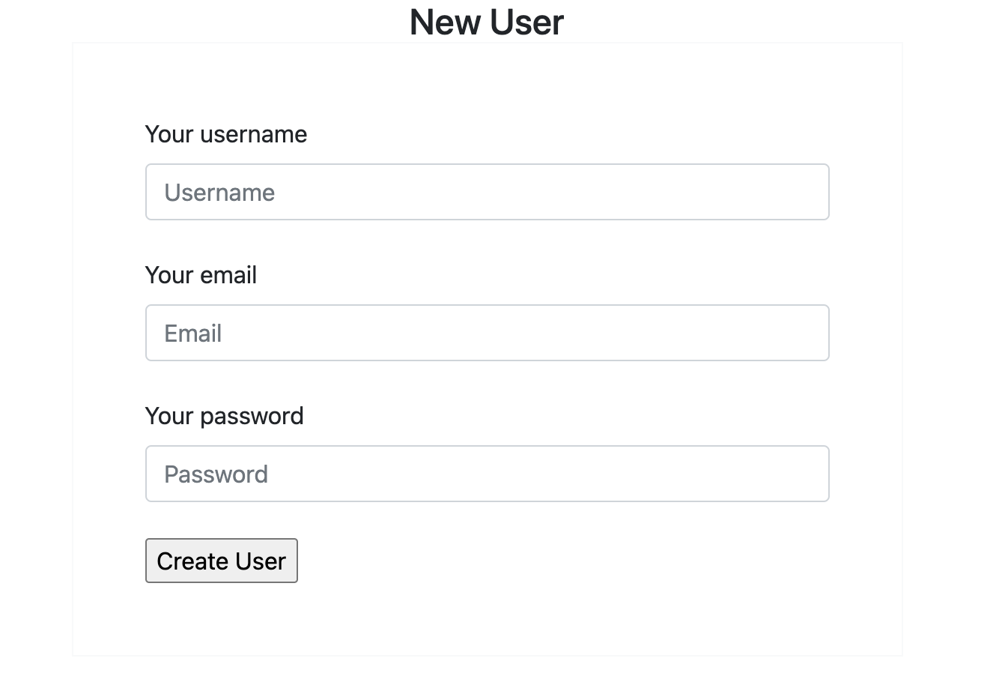

# Forms

## About the Project

This project is based on the [Odin Project Forms](https://www.theodinproject.com/courses/ruby-on-rails/lessons/forms). In this project, we built some forms both using nearly-pure HTML and then graduating to using the helper methods that Rails provide.

In this project we reviewed and learned the basics of Ruby on Rails including below:

- HTML Form with #form_authenticity_token method
- Railsy-er Forms with #form_with
- #errors and #full_messages

A list of commonly used resources that I find helpful is listed in the acknowledgments.

## Built With

- [Ruby on Rails](https://rubyonrails.org/)
- [Ruby](https://www.ruby-lang.org/en/)
- [Bootstrap gem](https://rubygems.org/gems/bootstrap/versions/4.0.0)

## Table of Contents

- [About the Project](#about-the-project)
- [Built With](#built-with)
- [Getting Started](#getting-started)
- [Authors](#authors)
- [Contributing](#contributing)
- [Show your support](#show-your-support)
- [License](#license)
- [Acknowledgements](#acknowledgements)

## Live Demo

[Live Demo Link](https://repl.it/@yocoono/mv-Forms)

## Getting Started

To get a local copy up and running follow these simple example steps.

1. On the project GitHub page, navigate to the main page of the repository.
2. Under the repository name, locate and click on a green button named `Code`.
3. Copy the project URL as displayed.
4. If you're running the Windows Operating System, open your command prompt. On Linux, Open your terminal.
5. Change the current working directory to the location where you want the cloned directory to be made. Leave as it is if the current location is where you want the project to be.
6. Type git clone, and then paste the URL you copied in Step 3.
   e.g. $ git clone `https://github.com/yourUsername/yourProjectName`
7. Press Enter. Your local copy will be created.

## Authors

👤 **Igors Oleinikovs**

- GitHub: [@githubhandle](https://github.com/Igors78)
- Twitter: [@twitterhandle](https://twitter.com/oleinikovs)
- LinkedIn: [LinkedIn](https://www.linkedin.com/in/igors-oleinikovs-17a10958/)

👤 **Yoko Saka**

- GitHub: [@yocosaka](https://github.com/yocosaka)
- Twitter: [@yocosaka](https://twitter.com/yocosaka)
- LinkedIn: [Yoko Saka](https://www.linkedin.com/in/yokosaka)

## Contributing

Contributions, issues, and feature requests are welcome!
Feel free to check the [issues page](../../issues).

1. Fork the Project
2. Create your Feature Branch (`git checkout -b feature/AmazingFeature`)
3. Commit your Changes (`git commit -m 'Add some AmazingFeature'`)
4. Push to the Branch (`git push origin feature/AmazingFeature`)
5. Open a Pull Request

## Show your support

Give a ⭐️ if you like this project!

## License

This project is [MIT](./LICENSE) licensed.

## Acknowledgements

- [Odin Project Forms](https://www.theodinproject.com/courses/ruby-on-rails/lessons/forms)
- [#form_for Rails API docs](https://apidock.com/rails/ActionView/Helpers/FormHelper/form_for)
- [w3 docs for forms](http://www.w3schools.com/tags/tag_form.asp)
- [Form Tag API Documentation](http://api.rubyonrails.org/classes/ActionView/Helpers/FormTagHelper.html#method-i-form_tag)
